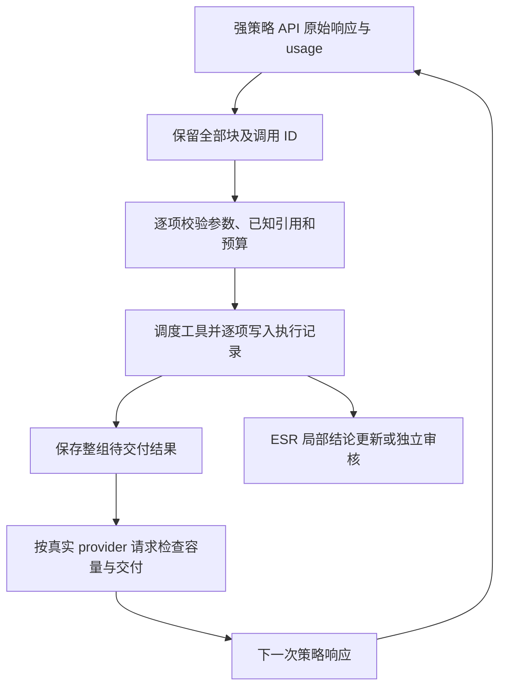

# ESR 与强策略 API 的工具执行分析

核对日期：2026-09-10。源码基点：`dd42ce135036ef2f7967265c1afb35ed46577a25`，分支 `research/strong-api-esr-20260909`。本次工作只新增离线复现脚本和分析报告，没有改变线上协议，没有调用被测模型、auditor、judge 或 BC+ 检索服务。全部复现使用合成数据；真实轨迹仅在本地分析。

## 1. 结论与证据边界

核心问题是 **harness 将一次模型决策限定为一个工具动作，而当前强策略 API 可以在一次响应中给出多个调用**。历史代码还存在截断调用、丢失错误反馈及切断调用与结果配对的问题。当前 2.1 已经保留原始响应，但采用整包拒绝，导致正常检索意图反复消耗模型请求。

ESR（Evidence-State Research，保存原始证据并维护研究结论的机制）的证据与状态分离仍有价值；应先修复所有实验臂共用的解析、执行与结果交付，再检验状态和审核是否提高正确率、降低成本。当前数据无法证明 ESR 有效，也无法把 E-soft 的失败归因于 auditor。

证据分三类：真实运行记录确认的行为、合成输入复现的代码机制、尚未实现的设计建议。下文不把后两类写成真实实验收益。

## 2. “丢掉后续工具”具体发生在哪里

| 位置 | 实际行为 | 证据和适用范围 |
|---|---|---|
| 历史 Stage0 `LanzPolicy._extract_action` | 严格解析失败后，从任意文本提取第一个配平的 JSON；后面的对象不再处理 | 合成两个合法动作，返回第一个。归属于归档脚本，不是当前 2.1 路径 |
| `api/lanz_client.py::_extract_text` | 只拼接 `text` 块；原生 `tool_use` 不会出现在返回文本中 | 合成纯工具响应返回空字符串。当前 `remote.py` 使用原始 `request()` 响应，绕开了这个文本辅助函数 |
| 旧 `src/esr_grpo/rollout.py::AgentRunner.run` | 先把所有调用写入 assistant 消息，再执行 `tool_calls[:max_parallel_calls]` | 默认上限为 **5**；复现 7 项声明、5 项结果、2 个调用没有回执。不能笼统称为“始终只执行第一个” |
| 同一旧 runner 的 `zip(calls, results)` | 后端返回结果数量不足时，没有检查配对完整性 | 注入 2 项调用、1 项结果，第二项静默消失。是可复现防御缺口，不代表已在真实后端发生 |
| 旧 `OpenAIChatPolicy.next_turn` 与 runner | 非法参数被过滤；如果同轮还有合法调用，丢弃说明不会触发恢复提示 | 合成合法/非法各一项，规范化消息只保留合法项，无恢复提示。原始对象保存在 `PolicyTurn.raw`，不等于已交还模型 |
| 旧 `_maybe_compact` | 保留最后 5 条消息，可能切断 assistant 调用和 tool 结果组 | 合成 5 项结果，压缩后对应 assistant 已消失，留下 5 个悬空结果 ID |
| 当前 `src/esr_harness/remote.py::complete` | `len(calls) != 1` 时整包报 `protocol_error` | Sep10 两个模型的真实记录确认。原始响应已经入账；所有调用均未执行。后续 `calls[0]` 位于数量检查之后，不是静默取第一项 |

旧 `esr_grpo/environment.py` 还有异常处理不一致：串行 `execute_tool` 包装参数签名 `TypeError`，并行方法直接调用工具，只捕获 `IllegalActionError`。这是源码确认的恢复缺口，尚未认定为本批失败原因。旧实现还包含强制提取 baseline 终答的逻辑；不能把它与当前正式提交口径混用。

### 当前仍存在的提示与状态不一致

`readiness()` 对空状态的 `verify_answer` 给出 `ready=true`，而 `available_tools()` 不提供该工具；审核缓存存在时也有“可读取缓存”和“策略不再提供重复审核”两个层次。程序允许直接读取缓存本身合理，但给策略的状态应明确“当前可调用 / 当前不提供及原因”，不能用一个 `ready` 同时表达它们。

当前原生工具请求还采用字符串形式的历史：baseline 把动作和结果重新编码成 assistant/user JSON，ESR 则发送新的状态工作卡。原生 `tool_use.id` 没有成为逐项动作和下一轮 `tool_result` 的关联键。这种映射已经得到 HTTP 200，但不能等同于完成标准原生多工具往返验收；它是否增加模型违规率仍需单独检验。

## 3. 最新真实运行说明了什么

Lanz-Medium 路由的响应标识为 `DeepSeek-V4-Flash-0731`。网关别名不证明权重固定。原开发集首题的三臂记录如下，全部使用相同的 CPU 全语料索引和共同预算：

| 实验臂 | 在线模型请求 | 多调用拒绝 | 实际后端请求 | 结束状态 | 耗时 |
|---|---:|---:|---:|---|---:|
| B：普通检索 baseline | 4 | 1 | 2 | 正式提交，独立判分正确 | 48.74 秒 |
| E-off：ESR 状态，关闭审核 | 10 | 1 | 2 | 正式提交，独立判分正确 | 165.23 秒 |
| E-soft：ESR 状态与软审核 | 14 | 6 | 4 | 错误上限停止，未提交 | 173.14 秒，失败耗时 |

E-soft 六次被拒的组合依次为 `update_state/search`、`search/search`、`search/search`、`open_page/open_page`、`search/search`、`read_evidence/read_evidence`。每组两项均非完全相同参数的重复块。28 次在线请求均 HTTP 200，无本批鉴权、限流或传输重试；E-soft 的 **auditor 请求为 0**。

因此，当前可以确定的是接口限制制造了额外请求和失败。E-off 本题即使只被拒一次，也用了更多模型请求，说明状态维护开销还需要分析，不能承诺修复多工具就一定超过 baseline。单题、不同策略轨迹不足以估计总体准确率，也不能用“去掉失败步骤”重算一条虚构的成功轨迹。

数据详情见 [Lanz 多轮检查报告](LANZ_MEDIUM_CHECKPOINT_20260910.md)。这三局仅用于开发诊断；确认集尚未启用。

## 4. ESR 中值得保留和需要降低负担的部分

### 4.1 原始证据、当前结论与控制信息应继续分开

当前系统保存原始 observation 及内容哈希，claim 保存 requirement、finding 和 observation IDs，candidate 保存待提交答案。ID、状态版本、缓存、预算和交付记录由程序管理。这个划分能支持回查证据、修改结论及复现状态变化。

它解决的是“模型看到了什么、据此写了什么、后来怎样修改”的工程问题。它不会自动保证 finding 正确，也不会因为引用存在就证明关系推断成立。例如同时找到两个人的年份记录，仍需核对是否属于同一赛事、实体或组织。审核必须检查原问题要求的关系，而不只是关键词和引文存在。

保存动作与证据的关联也不等于获得因果贡献。未来训练若使用最终奖励，不能仅凭某工具被引用就宣称它应获得正向动作奖励；本次前向实验没有验证这种训练方法。

### 4.2 审核应检查固定证据中的语义，不负责修理工具协议

fresh-context auditor 接收原问题、当前候选、claims 与允许引用的原始证据；程序检查引文可定位、ID 合法。语义审核仍可能漏判或误判。同一个强 API 承担两个角色只提供上下文隔离，不保证错误统计独立。

当前审核指纹依据语义输入与证据内容，focus、普通 note 不应使旧结论失效；候选或证据发生变化则应重新审核。这一方向合理。

需要明确：当前 `soft` 仍要求存在匹配当前状态的有效审核记录，只是允许非 supported 的审核结论提交；它不表示审核可省略。`off`、`soft`、`hard` 的成本和停止条件不同，应各自明示。遇到 JSON、工具 ID、结果丢失等问题，应由确定性程序处理，避免再花一个强模型请求让 auditor 修接口。

### 4.3 控制字段和额外轮次是实际成本

强模型通常希望“提出多个查询→阅读若干结果→更新结论”。若每一步都强制单调用、切换 focus、处理 pending、更新 note，研究任务就会混入大量状态维护。应让模型主要决定查询、结论修订和证据不足处，程序自动维护确定性的计数、引用索引及执行记录。

`pending` 表示尚待吸收或放弃的证据；“本轮调用返回、下一请求必须交付”的队列是另一个对象。两者必须分开，不能靠把已引用证据重新塞进 pending 来保证交付，否则一次重读会额外制造一次状态清理义务。

claim 分解应服务于关系核对。初始联合 claim 可以表达短问题，多关系问题则允许按需要拆分；不应要求每个小搜索都先完成一套研究计划。是否减少强制状态更新，属于后续有界机制实验，应与工具兼容修复分开检验。

## 5. 为什么只把单动作改成循环还不够

离线反例的步骤为：打开两份合成证据 o1/o2，记录真实交付，将二者引用到 finding，随后不插入模型决策，依次执行 `read_evidence(o1)`、`read_evidence(o2)`。

两个读取都成功，但下一工作卡的 `visible_evidence` 只有 o2。原因是：

1. 已引用视图重读不会重新加入 pending，这是当前避免重复状态义务的设计。
2. `engine._apply()` 每次覆盖一个 `latest_result`。
3. `context.visible_ids()` 只取 pending 加最后一个结果的 observation。
4. 第一项结果的正文仍在档案，却未进入下一次策略请求。

这个反例是在当前 engine 上模拟“天真批执行”的后果。当前 runner 会先拒绝多调用，所以不能说现有真实双调用已经按这个路径执行并丢正文。

同时，多次 search 的结果也不能只依赖最近两条 focus attempt 卡片。批次返回的每项查询结果、错误、文档 ID 都必须有明确交付位置，摘要目录不能冒充完整工具结果。

## 6. 建议的共同工具层



### 6.1 一次决策包含若干调用；每项必须有结果或明确未执行原因

建议增加模型决策对象，保存 `decision_id`、`request_id`、原始 content 块与有序调用列表。每项记录原始 ID、序号、名称、参数和解析错误；工具执行记录继续使用独立 `action_id`，关联所属决策和调用 ID。缺失或重复的 provider ID 应明确判为格式错误，不能静默生成 ID 后伪装成原始输出。

逐项状态至少区分：成功、参数/引用不合法、执行失败、依赖失败未执行、预算/容量不足未执行。原始响应含两项合法调用时，不应归为 JSON 解析错误。原始文本输出仍只接受已声明的无歧义形式，不恢复“任意散文取第一个 JSON”。

原生协议支持多工具，并要求每个调用都有匹配结果；未执行项也可以返回错误结果。接入时应保留完整 assistant 调用块，在下一 user 消息中一起返回对应 `tool_result`。执行顺序由工具语义决定。参见 [Anthropic 原生多工具文档](https://platform.claude.com/docs/en/agents-and-tools/tool-use/parallel-tool-use)。这是协议依据，不证明 Lanz 网关实现了全部 Claude 行为。

当前请求已经设置 `tool_choice.disable_parallel_tool_use=true`，真实响应仍出现多个块。因此仅重复添加禁并行字段或加重提示，不能解决已观测的不一致。应记录该路由的能力验收结果。

### 6.2 第一阶段只接纳有界、独立的检索组合，先顺序执行

建议首版候选上限为每次决策 4 项，参数写入新协议版本并与基线共用。这是保守工程起点，不是实验证明的最优值。接受多项调用不要求同时启用线程：先按稳定顺序执行、统一写账，可以减少模型往返；后续再评估后端并发。

| 组合 | 首版建议 | 条件 |
|---|---|---|
| search + search | 可成组 | 每项语法合法，查询意图和控制状态没有冲突 |
| open_page + open_page | 可成组 | 两个文档 ID 在决策前已知，整组容量足够 |
| read_evidence + read_evidence | 可成组 | 视图已存在，所有正文进入待交付队列 |
| search + open_page | 有条件成组 | open 的文档必须在本轮前已知，不能猜测尚未返回的新搜索结果 |
| update_state + search | 首版暂不成组 | 涉及结论或 focus 修改，需先明确有序状态语义；每项反馈具体原因 |
| verify + update/submit，或 finish 与其他工具 | 保持独立决策 | 模型应先看到审核或执行结果，再决定如何修改与提交 |

“检索工具”在当前实现中也有共享状态：`search(focus=...)` 修改全局 focus；open 会分配 observation ID、写入 pending，并选择搜索父节点。不能直接把现有 `Harness.execute()` 放进线程池。当前 ledger 明确要求一个 episode 只有一个写入者。

批次入口应固定可用 ID 和搜索父节点的解析依据。否则一项 search 插入新记录后，另一项 open 的默认父节点可能改变，执行虽然成功，搜索来源却被记错。不得让同批后项引用尚未交付的 oN，也不应根据模型猜测的新 cN 自动绑定新 claim。

对不同 focus 的搜索，首版可限制为同一有效 focus，明确拒绝冲突。长期更自然的设计是“每个调用携带本次查询的目的”，与全局下一步 focus 分开；不同研究问题本身并不使两项查询非法。不能把首版实现限制包装成 ESR 的理论要求。

已有私有离线回放在 EB 的 8 个真实双调用状态前检查 schema、已知 ID、有效 focus、动作余量，7 个符合上述候选检索规则，1 个 focus 冲突。它未执行后端、未验证整组容量，也未生成后续策略，因此只能说明规则覆盖范围，不能写成 7 个 bad case 已修复。

### 6.3 结果交付和容量必须按整组处理

增加独立的待交付结果集合，保护整轮的成功结果、失败信息和重读正文。baseline 保留普通检索历史；ESR 保留状态工作卡与证据档案；两者共用同一原生调用/结果编码器与本轮结果完整性要求。历史压缩只能在完整调用/结果组的边界进行。

容量检查应针对最终 provider 请求和整组结果，不能只检查最后一个动作的 preview。执行前根据工具的有界返回预留容量；若实际大小超出估计，保留已取回原始数据和花费，按已声明的窗口/分页规则交付，或明确停止。不能悄悄删掉前项正文，也不能把每项都判定“能放下”后假设合起来一定能放下。

交付记录应保存请求中确实包含的 observation IDs、视图哈希和对应调用。收到 provider 响应后可记录“该请求已交付”；这仍不是模型认知上读懂证据的证明。超时只保留未知状态，不把仅写进日志的证据标记成已交付。

### 6.4 部分失败应可恢复，不能整组盲重试

独立读取中一项失败，可以保留其他项成功结果并逐项反馈。有状态依赖时，失败后尚未运行的项应明确为 skipped。不能把网络调用的花费回滚，也不能通过重新执行整组来伪装全成功。

重启恢复必须检查既有执行记录。已完成项不重做；请求发出但没有响应的项保留结果未知和保守预算占用。只有明确可重试的传输错误才按固定上限重试，且每次计费请求单独记录。协议错误返回字段级诊断；同一确定性错误不应无限请求模型重新生成。

### 6.5 成本单位不能混为“调用次数”

| 单位 | 含义 |
|---|---|
| provider 请求 | 每次实际 HTTP 模型请求，区分 policy、audit、judge、probe、重试 |
| 模型决策 | 一份策略响应；可能提出多项工具调用 |
| 工具提议 / 实际动作 / skipped | 分别记录，不能把没执行的项算后端成功 |
| 后端请求 | 实际搜索/取页服务 I/O；缓存命中另记 |
| 交付成本 | 下一次输入中的实际结果和证据 token、上下文预留 |

一次响应提出两项 search，通常是 1 次 policy 请求和最多 2 次检索后端请求；两个查询结果会增加下一次输入。批执行可能减少往返，不保证总 token 或工具数下降。1000 请求配额的具体计数仍应以网关规则为准，不能按 episode 或本地 action 推定。

错误停止规则也要显式迁移：逐调用错误数、含错误的模型决策数应同时保存。不能把一组两个错误无说明地当成旧版两轮错误，导致新协议更早停，也不能通过整组计一次掩盖后端失败。新协议预登记对应阈值，并对三臂一致应用。

## 7. 实施顺序与验收

1. **先做共同执行层修复**：无损模型决策表示、逐项回执、完整结果交付、状态/提示一致、可恢复记账。保留旧协议读取和旧实验记录，新版本独立标识。
2. **再开放有界检索组合**：顺序调度、批次入口引用校验、整组容量预留。此时不同时改变 ESR claim 设计、审核门槛或答案评分。
3. **最后评估状态写入组合和维护开销**：只有轨迹显示必要，才单独设计 update/search 的有序语义；不接受盲循环执行任意组合。

离线验收至少覆盖：原始 N 项调用对应 N 项状态回执；超限、非法参数、缺失/重复 ID；合法与非法项混合；重读 o1/o2 全部交付；多搜索全部结果；搜索父节点固定；前向引用拒绝；pending/上下文/动作/请求预算边界；部分超时、进程中断和重启不重做成功项；完整消息组压缩；baseline 与 ESR 获得一致工具能力。审核仍单独验收一次真实完整往返。

这些是实质性执行协议变更，应更新配置、manifest、日志版本和共同 baseline 后再比较。之前已登记的机制迭代预算不能自动重置。新增工程分析不消耗模型预算，后续真实验收继续受既有更严格额度约束；不扩大样本，不打开确认集，不重跑到成功。

模型接口修好后，正式比较 B、E-off、E-soft：前者是共同工具层下的正常检索策略，后两者分别隔离状态维护、审核与修订的增量。保留未提交失败；同时报告准确率、实际各类请求、token、后端请求及正确完成时间。失败停止时间不能充当正确完成速度优势。

## 8. 研究依据及适用限制

- [AgentFold（2025）](https://arxiv.org/html/2510.24699v1) 研究主动上下文管理，并使用专门生成、筛选的轨迹进行训练；论文明确提到仅靠提示生成复杂结构输出的困难。对本项目的启发是降低状态维护负担、保护可恢复证据；不能据此宣称未经训练的 Lanz 策略天然适应 ESR，也不能在本实验中借用其拒绝采样删除失败轨迹。
- [When Tools Fail / ToolMaze（2026-06）](https://arxiv.org/html/2606.05806v1) 区分显式/隐式、暂时/持续工具故障，并分别衡量任务成功和恢复成本。可借鉴这种分类给共同工具层做合成故障注入；其论文成绩不能外推为 BC+ 的 ESR 收益。

本仓库最直接的修复依据仍是实际 provider 请求、执行日志和上述反例。文献用于解释与制定验收，不进入被测策略或 auditor 的任务输入。

## 9. 复现与交付

仓库根目录执行：

```powershell
python scripts/reproduce_tool_contract_gaps.py
```

脚本调用真实历史解析/runner 与当前 engine 的本地函数，网络入口用 stub 替换，检索器仅含两份合成文档。输出 8 个已断言成立的机制反例。它是缺陷复现脚本，**断言通过表示成功复现当前缺口，不表示产品已经修复**。`--output <新文件>` 可保存 JSON，使用排他创建避免覆盖。

本次运行结果保存在私有研究目录 `runs/strong_api_esr/20260909T085343Z/tool_contract_deep_audit_20260910.json`。先前真实状态检查及重读交付反例保存在同目录的 `multi_tool_design_validation_20260910.json`。没有复制原问题、文档正文或参考答案到本报告。

交付状态：源码与历史轨迹分析完成，8 项离线反例复现完成；线上多工具改造尚未实施，修复后的真实审核、三臂收益和确认集结果均待验证。本次新增被测 API 请求数为 **0**。
