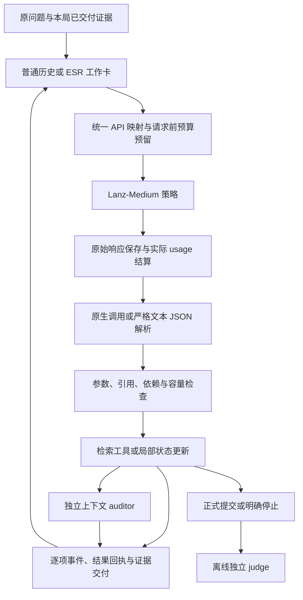

# harness 与强策略 API 的完整链路复核

复核对象：`a79801746dc9eb4469c75b2b0b3967a89efd2284`。本次只读生产源码、回看已有真实轨迹，并使用合成数据复现边界行为；没有调用远程模型、读取新题或修改生产执行逻辑。

**结论：主链路已经真实跑通，正常检索组合按设计工作；目前仍有两个已复现的转换/失败分支缺陷，不能称为无 bug 或已完成全面验收。** 最近四局的成功记录仍成立，但它们没有覆盖这两个分支。此前 264 项测试通过也不能替代新增组合场景的检查。

## 1. 当前实际链路与验证程度



| 环节 | 已有证据 | 当前结论 |
|---|---|---|
| API 接入和真实 provider body | 新验收 21 次在线响应均 HTTP 200；返回 DeepSeek-V4-Flash-0731 | 已通；只核实了网关别名，未固定权重 |
| 策略选择与原生调用解析 | 18 份策略决策、20 项工具回执，真实触发两次双检索 | 正常单调用与独立双检索已验收 |
| 检索后端 | B/E-off/E-soft 分别发生 3/2/3 次实际 CPU 全语料检索后端请求 | 已通，无需本机显卡承担模型推理 |
| 状态局部更新和提交 | E-off/E-soft 均更新状态并正式提交 | 成功路径已验收；批内 focus 失败依赖仍有缺陷 |
| 结果交付 | 实际 body 配对检查及 4 次正文交付检查无缺失；双重读由离线回归覆盖 | 已验证场景中没有静默丢后续结果 |
| 审核 | 合成流程审核成功，开发题 E-soft 审核成功 | 已通；合成首个审核为空对象，需要一次格式修复 |
| 正式答案评价 | 同一开发题三臂均独立判正确 | 已通，但单题不能估计总体准确率 |
| 用量与预算 | 本阶段 24 请求；全局增量与原始 usage 相符，旧未知 4 笔保留 | 本批记账核对通过 |
| 中断恢复与异常转换 | 有多项合成回归；本次另发现两个组合缺陷 | 未达到完整可靠性验收 |

policy/auditor 仍是远程模型；harness 负责提供上下文、校验、执行、记账和停止。程序没有代替 policy 写 BC+ 查询或答案。模型看见证据不等于理解正确，审核 supported 也不等于独立判分正确。

## 2. 新确认缺陷 A：原生历史之后的文本动作可能使 baseline 崩溃

触发条件：baseline 已有一轮原生 search，下一轮 API 返回当前协议允许的严格文本 JSON search。文本动作需要预演状态，检查下一请求能否容纳新结果。

调用链为 `runner.run → Harness.execute → admission(_preview(event)) → messages_for → native_messages`。`tool_turn.py` 为文本动作确定历史排序时，使用 `next(...)` 从已经落盘的 ledger 查找 action ID；预演中的新动作尚未落盘，因此找不到，抛出 `StopIteration`。

完整 runner 的合成复现结果：本地策略 stub 调用两次，只有第一次动作提交，第二次抛异常，`terminal=None`。这不是远程 API 拒绝，也不是模型违反单动作格式。实际检索可能已发生，但该动作尚未形成正常 tool 结束记录；不能把它视为可忽略的显示问题。

最小修复方向：为预演事件提供稳定的暂定排序位置，不把“尚未写入日志”当成不可能状态；已落盘事件仍按真实顺序渲染。补充 native→text、text→native、多次交替，以及搜索/打开/重读的容量预演测试。这里不应该通过禁用已承诺的文本 fallback 来掩盖问题。

## 3. 新确认缺陷 B：首项 focus 修改失败，后项可能按旧 focus 执行

触发组合：第一项 search 显式设置新 focus，但携带未交付的 `anchor_refs`；第二项 search 省略 focus，按现有组规则被认为继承前项的新 focus。

`prepare()` 按计划更新后的 focus 判断两项一致。然而第一项实际执行返回 `unexposed_reference`，engine 撤销 focus 修改。调度器对这种错误继续执行后项，后项读取当前旧 focus，成功结果记录的研究目的与计划不一致。

合成复现结果：第一项失败，`focus_edit_applied=false`；第二项成功，其 purpose.need 是原问题，未使用本组计划的新问题。查询字符串没有被篡改，但检索目的、后续 attempt 卡片与研究方向可能错误关联。这说明两项在当前控制状态语义下并不完全独立。

最小修复方向：组计划显式记录每项依赖的 focus，执行前检查前置状态是否成立。前项没有提交必要修改时，依赖它的项返回“前置修改失败，未执行”；真正独立的项仍可继续。不能把准备阶段的预计状态当成已经提交的状态，也不应静默替模型改写研究目的。

## 4. 属于设计限制或证据不足的部分

- 至多 4 项检索，当前顺序执行。多调用支持不代表线程并发，也不代表任意工具可以混合。
- 状态更新、审核、提交单独决策；多个不同 focus 的检索组仍有限制。这些限制已声明，本身不等于 bug，但仍会增加协议负担。
- 每项未知结果的 8192 字节预留只是估计。累计容量检查可以明确拒绝过大的组，并不保证所有合理查询组合都能容纳；长上下文和临近预算末尾的终止路径仍需专门覆盖。
- 中断后的“结果未知”路径当前会保留账目并停止，避免重复执行。它不等于能自动恢复到正确完成任务。
- 一道开发题无法检验多跳、长证据链、反复候选修订、审核误拒/误放等全部研究行为。
- E-off 本题比 B 少一次后端请求且更快，但模型请求/token 更多；E-soft 模型请求/token 与耗时均更多。预期的总体效果优势尚未建立。

当前更准确的状态是：**具备最小真实端到端能力，正常路径已验收，边界可靠性仍待修复，研究收益仍待完整对照。** 应先修复上述两个离线缺陷，再安排有界的复杂链路验收；不通过继续跑大量题来复现已经定位的程序错误。

## 5. 复现与资料

```powershell
python scripts/reproduce_native_transition_edges.py
```

脚本仅含一份合成文档和本地策略 stub；输出为两个缺陷已复现的断言结果，不是产品通过验收。可用 `--output <新文件>` 排他保存结果。本次记录：`runs/strong_api_esr/20260909T085343Z/native_transition_edges_20260910.json`。

已有真实证据见[原生多工具验收](NATIVE_TOOL_TURN_ACCEPTANCE_20260910.md)，实现范围见[实现说明](NATIVE_TOOL_TURN_IMPLEMENTATION_20260910.md)。本次新增 API 请求为 0，两个新缺陷尚未修改生产代码。
